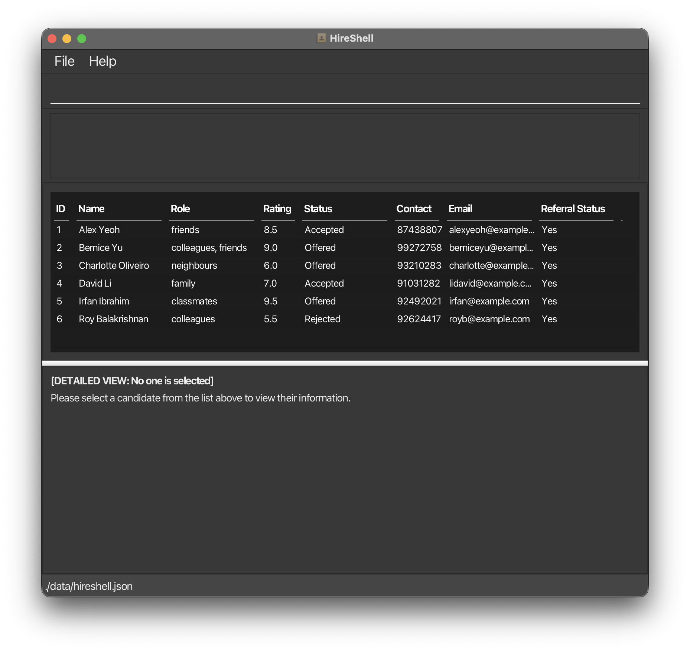

# HireShell

HireShell is a **desktop contact management application** designed for **Job Recruiters** who prefer **speed and efficiency**
in managing (e.g. adding, deleting, editing) a large number of applicant contacts. It combines a Command Line Interface
(CLI) with the clarity of a Graphical User Interface (GUI).

If you are a Job Recruiter and are comfortable typing commands fast, HireShell helps you to organise, categorise and
filter applicant contacts quickly, with minimal use of a mouse.

Instead of clicking through multiple menus, you can perform all actions using simple, structured commands.
This lets you manage and review applicants more efficiently once you are familiar with the command format.

**What you can expect**\
In this guide, you will find:
- A [Quick Start](#quick-start) section to get the app running
- An overview of the user interface
- Step-by-step instructions for using commands
- Examples to help you learn faster
- Troubleshooting tips

<!-- * Table of Contents -->
<page-nav-print />

--------------------------------------------------------------------------------------------------------------------

## Quick Start

1. Ensure you have Java `17` or above installed in your computer.<br>
   **Mac users:** Follow the setup guide [here](https://se-education.org/guides/tutorials/javaInstallationMac.html).

2. Download the latest `hireshell.jar` file from [here](https://github.com/AY2526S2-CS2103T-T10-3/tp/releases).

3. Create a folder (e.g. named **HireShell**).

4. Move the `hireshell.jar` file into this folder.

5. Open a command terminal and navigate to the **HireShell** folder.
   - **Windows:** Use Command Prompt or PowerShell
   - **Mac/Linux:** Use Terminal

Example:
```bash
cd path/to/HireShell
```

6. Run the application using the following command:
```
java -jar hireshell.jar
```

7. If the setup is successful, the HireShell GUI (see below) should appear in a few seconds. \
_**Note that the app contains sample data.**_<br> \


8. Type the command in the command box and press `Enter` to execute it. e.g. typing **`help`** and pressing `Enter` will open the help window.<br> \
   Some example commands you can try:

   * `list` : Lists all contacts.

   * `add n/John Doe p/98765432 e/johnd@example.com rt/8.5 s/Fresh rs/Yes r/Software Engineer` : Adds a contact named `John Doe` to the Address Book.

   * `delete 3` : Deletes the 3rd contact shown in the current list.

   * `clear` : Deletes all contacts.

   * `exit` : Exits the app.

9. Should you wish to scroll through the table, simply push the 'tab' button on your keyboard to tab into the table,
and use the arrow keys to scroll up and down. To tab out of the table and into the command box, 
simply push the 'tab' button again.

10. Refer to the [Features](#features) below for details of each command.

--------------------------------------------------------------------------------------------------------------------

## List of fields

| Field Name               | Explanation, Examples                                                                                                                                                                                                                                                                                                                                                                                                                                                                                                                                                                                                                                                                                                                                                |
|--------------------------|----------------------------------------------------------------------------------------------------------------------------------------------------------------------------------------------------------------------------------------------------------------------------------------------------------------------------------------------------------------------------------------------------------------------------------------------------------------------------------------------------------------------------------------------------------------------------------------------------------------------------------------------------------------------------------------------------------------------------------------------------------------------|
| **`n/NAME`**             | Name of the contact. Only accepts alphanumeric characters.<br> e.g., `n/James Ho`                                                                                                                                                                                                                                                                                                                                                                                                                                                                                                                                                                                                                                                                                    |
| **`p/PHONE_NUMBER`**     | Contact's Phone number. Only accepts numbers, and should be at least 3 digits long, to a max of 15 digits.<br> e.g., `p/91234567`                                                                                                                                                                                                                                                                                                                                                                                                                                                                                                                                                                                                                                    |
| **`e/EMAIL`**            | Contact's Email address.<br/>Email should be of the format local-part@domain and adhere to the following constraints:<br/>1. The local-part should only contain alphanumeric characters and these special characters, excluding the parentheses, (+ _ . -). The local-part may not start or end with any special characters.<br/>2. This is followed by a '@' and then a domain name. The domain name is made up of domain labels separated by periods.<br/>The domain name must:<br/>    - end with a domain label at least 2 characters long<br/>    - have each domain label start and end with alphanumeric characters<br/>    - have each domain label consist of alphanumeric characters, separated only by hyphens, if any.<br> e.g., `e/jamesho@example.com` |
| **`[rt/RATING]`**        | Company's rating of the contact. Optional field, defaults to `0.0` if not entered. Only accepts numbers between 0 to 10 (decimals allowed).<br> e.g., `rt/8.5`                                                                                                                                                                                                                                                                                                                                                                                                                                                                                                                                                                                                       |
| **`s/STATUS`**           | Status of the contact's application.<br> e.g., `s/Rejected`                                                                                                                                                                                                                                                                                                                                                                                                                                                                                                                                                                                                                                                                                                          |
| **`rs/REFERRAL_STATUS`** | Referral Status of the contact (i.e. was the contact referred by someone?). Only accepts 'Yes' and 'No' (Non-case sensitive).<br> e.g.,`rs/Yes`                                                                                                                                                                                                                                                                                                                                                                                                                                                                                                                                                                                                                      |
| **`[r/ROLE]…`​**         | Role that the contact applied for. Optional field, each contact can have more than 1 role.<br> e.g., `r/Software Engineer r/DevOps`                                                                                                                                                                                                                                                                                                                                                                                                                                                                                                                                                                                                                                  |
| **`[d/DETAIL]`**         | Additional details related to the contact. Optional field.<br> e.g., `d/Met at career fair`                                                                                                                                                                                                                                                                                                                                                                                                                                                                                                                                                                                                                                                                          |


--------------------------------------------------------------------------------------------------------------------

## Features

<box type="info" seamless>

**Notes about the command format:**<br>

* Words in `UPPER_CASE` are the parameters to be supplied by the user.<br>
  e.g. in `add n/NAME`, `NAME` is a parameter which can be used as `add n/John Doe`.

* Items in square brackets are optional.<br>
  e.g `n/NAME [r/ROLE]` can be used as `n/John Doe r/Software Engineer` or as `n/John Doe`.

* Items with `…`​ after them can be used multiple times including zero times.<br>
  e.g. `[r/ROLE]…​` can be used as ` ` (i.e. 0 times), `r/Software Engineer`, `r/Software Engineer r/AI Analyst` etc.

* Parameters can be in any order.<br>
  e.g. if the command specifies `n/NAME p/PHONE_NUMBER`, `p/PHONE_NUMBER n/NAME` is also acceptable.

* Extraneous parameters for commands that do not take in parameters (such as `help`, `list`, `exit` and `clear`) will be ignored.<br>
  e.g. if the command specifies `help 123`, it will be interpreted as `help`.

* If you are using a PDF version of this document, be careful when copying and pasting commands that span multiple lines as space characters surrounding line-breaks may be omitted when copied over to the application.
</box>

### Viewing help : `help`

Shows a message explaining how to access the help page.


Format: `help`


### Adding a person: `add`

Adds a person to the address book.

Format: `add  n/NAME p/PHONE e/EMAIL [rt/RATING] s/STATUS rs/REFERRAL_STATUS [d/DETAIL] [r/ROLE]…​`

* Persons with the same name/phone number can be added
* Persons with **both** the same name and phone number will be considered a duplicate person, 

<box type="tip" seamless>

**Tip:** A person can have any number of roles (including 0)
</box>

Examples:
* `add n/John Doe p/98765432 e/johnd@example.com s/Approved rs/Yes`
* `add n/Betsy Crowe e/betsycrowe@example.com rt/9 s/Fresh rs/Yes p/91234567 r/SoftwareEngineer r/QuantitativeResearcher`
* `add n/Alex Yeoh p/12345678 e/alexy@example.com s/Approved rs/Yes d/Met at career fair`


### Listing all persons : `list`

Shows a list of all persons in the address book.

Format: `list`

### Editing a person : `edit`

Edits an existing person in the address book.

Format: `edit INDEX [n/NAME] [p/PHONE] [e/EMAIL] [rt/RATING] [s/STATUS] [rs/REFERRAL_STATUS] [d/DETAIL] [r/ROLE]…​`

* Edits the person at the specified `INDEX`. The index refers to the index number shown in the displayed person list. The index **must be a positive integer** 1, 2, 3, …​
* At least one of the optional fields must be provided.
* Existing values will be updated to the input values.
* When editing roles, the existing roles of the person will be removed i.e adding of roles is not cumulative.
* You can remove all the person’s roles by typing `r/` without
    specifying any roles after it.
* If a person is updated in a way that causes their details to exactly match an already existing person (ignoring roles/statuses), an error will be thrown to prevent duplicate persons

Examples:
*  `edit 1 p/91234567 e/johndoe@example.com` Edits the phone number and email address of the 1st person to be `91234567` and `johndoe@example.com` respectively.
*  `edit 2 n/Betsy Crower r/` Edits the name of the 2nd person to be `Betsy Crower` and clears all existing roles.

### Locating persons by name: `find`

Finds persons whose names contain any of the given keywords.

Format: `find KEYWORD [MORE_KEYWORDS]`

* The search is case-insensitive. e.g `hans` will match `Hans`
* The order of the keywords does not matter. e.g. `Hans Bo` will match `Bo Hans`
* Only the name is searched.
* Only full words will be matched e.g. `Han` will not match `Hans`
* Persons matching at least one keyword will be returned (i.e. `OR` search).
  e.g. `Hans Bo` will return `Hans Gruber`, `Bo Yang`

Examples:
* `find John` returns `john` and `John Doe`
* `find alex david` returns `Alex Yeoh`, `David Li`<br>

### Filtering persons by rating, status, date, or role: `filter`

Filters persons whose rating, status, date added, and/or role match the specified criteria.

Format: `filter [rt/RATING_FILTER] [s/STATUS] [dt/DATE_FILTER] [r/ROLE]`

* At least one of the optional fields must be provided.
* `RATING_FILTER` can include a comparison operator (`>`, `>=`, `<`, `<=`, `==`) followed by a number. If no operator is provided, `==` is assumed.
* `STATUS` matches the status field of the person (case-insensitive, partial matches allowed).
* `DATE_FILTER` can include an operator (`before`, `after`, `on`) followed by a date in `YYYY-MM-DD` format. If no operator is provided, `on` is assumed.
* `ROLE` matches one of the roles of the person (case-insensitive, partial matches allowed).
* If multiple criteria are provided, only persons matching **all** of them will be shown.

Examples:
* `filter rt/ >= 7` returns persons with a rating of 7.0 or higher.
* `filter s/Inter` returns persons whose status contains "inter" (e.g., "Interviewing").
* `filter r/soft` returns persons who have a role containing "soft" (e.g., "Software Engineer").
* `filter dt/on 2026-04-01` returns persons added on April 1st, 2026.
* `filter r/Software Engineer` returns persons who have the "Software Engineer" role.
* `filter rt/ < 5 s/Rej dt/before 2026-03-01 r/Int` returns persons with a rating less than 5.0, a status containing "rej" (e.g., "Rejected"), added before March 1st, 2026, and having a role containing "int" (e.g., "Intern").

### Sorting persons by rating or date: `sort`

Sorts the currently displayed list of persons by their rating or the date they were added.

Format: `sort rt/ORDER` or `sort dt/ORDER`

* `ORDER` must be either `asc` (for ascending order) or `desc` (for descending order).
* `rt/ORDER` sorts persons by their rating.
* `dt/ORDER` sorts persons by the date they were added.
* You can only sort by one field at a time.

Examples:
* `sort rt/desc` sorts persons from the highest rating to the lowest.
* `sort dt/asc` sorts persons from the earliest added to the latest.

### Deleting a person : `delete`

Deletes the specified person from the address book.

Format: `delete INDEX`

* Deletes the person at the specified `INDEX`.
* The index refers to the index number shown in the displayed person list.
* The index **must be a positive integer** 1, 2, 3, …​

Examples:
* `list` followed by `delete 2` deletes the 2nd person in the address book.
* `find Betsy` followed by `delete 1` deletes the 1st person in the results of the `find` command.

### Batch deleting persons : `batch delete`

Deletes all persons in the address book whose attributes match the specified condition(s). You can specify conditions based on status, roles, and a mathematical rating comparison.

Format: `batch delete [s/STATUS] [r/ROLE]... [rt/RATING_CONDITION]`

* Deletes everyone matching **ALL** provided conditions.
* At least one condition must be specified.
* `RATING_CONDITION` must start with a valid mathematical operator (`<`, `<=`, `>`, `>=`, `==`) followed immediately by the rating value (e.g., `< 3.0` or `>= 5`).
* If multiple roles are provided, it will find persons who have **all** the listed roles.

Examples:
* `batch delete s/REJECTED` deletes all persons with a status of REJECTED.
* `batch delete rt/< 3.0` deletes all persons whose rating is strictly less than 3.0.
* `batch delete s/APPLIED rt/<= 2.0 r/Intern` deletes all persons applying for an Intern role, currently APPLIED, and having a rating of 2.0 or lower.

### Batch editing persons : `batch edit`

Edits all persons in the address book whose attributes match the specified condition(s). The input is separated by the `to` keyword, where the left side dictates the filters and the right side dictates the edits to apply.

Format: `batch edit [s/STATUS] [r/ROLE]... [rt/RATING_CONDITION] to [n/NAME] [p/PHONE_NUMBER] [e/EMAIL] [rt/RATING] [s/STATUS] [rs/REFERRAL_STATUS] [r/ROLE]...`

* Edits everyone matching **ALL** the filter conditions specified on the left of `to`.
* Applies the exact exact new values provided on the right of `to`.
* The rating condition works exactly as it does in `batch delete`.
* At least one condition must be provided on the left side, and at least one edit field must be provided on the right side.
* If a person is updated in a way that causes their details to exactly match an already existing person (ignoring roles/statuses), an error will be thrown to prevent duplicate persons.

Examples:
* `batch edit r/Intern to s/REJECTED` changes the status to REJECTED for all persons who have the "Intern" role.
* `batch edit s/APPLIED to rt/5.0` sets the rating to 5.0 for everyone who currently has an APPLIED status.
* `batch edit rt/< 3.0 s/APPLIED to s/REJECTED rt/0.0 rs/No` finds anyone who is APPLIED with a rating < 3.0, and simultaneously changes their status to REJECTED, rating to 0.0, and referral status to Unsuccessful.
* `batch edit r/Frontend rt/> 8.0 to r/Frontend Lead s/INTERVIEWED` finds anyone with a Frontend role and a rating > 8.0, and updates their role to Frontend Lead and status to INTERVIEWED.

### Clearing all entries : `clear`

Clears all entries from the address book.

Format: `clear`

### Exiting the program : `exit`

Exits the program.

Format: `exit`

### Exporting data : `export`

Exports all contact data from the address book into a CSV file format, which can be opened in spreadsheet applications like Microsoft Excel or Google Sheets.

Format: `export`

* The command exports the entire list of persons currently stored in the address book.
* Extraneous parameters for this command (e.g., `export 123`) will be ignored.
* The data is typically saved in the same directory where the application is located.

Example:
* `export`

### Selecting a person : `select`

Selects the specified person from the address book to be displayed in a detailed view

Format: `select INDEX`

* Selects the person at the specified `INDEX`.
* The index refers to the index number shown in the displayed person list.
* The index **must be a positive integer** 1, 2, 3, …​

Examples:
* `list` followed by `select 2` selects the 2nd person in the address book and brings up a detailed view of the selected person
* `find Betsy` followed by `select 1` selects the 1st person in the results of the `find` command.


### Saving the data

HireShell data are saved in the hard disk automatically after any command that changes the data. There is no need to save manually.

### Editing the data file

HireShell data are saved automatically as a JSON file `[JAR file location]/data/hireshell.json`. Advanced users are welcome to update data directly by editing that data file.

<box type="warning" seamless>

**Caution:**
If your changes to the data file makes its format invalid, HireShell will discard all data and start with an empty data file at the next run.  Hence, it is recommended to take a backup of the file before editing it.<br>
Furthermore, certain edits can cause the HireShell to behave in unexpected ways (e.g., if a value entered is outside the acceptable range). Therefore, edit the data file only if you are confident that you can update it correctly.
</box>

### Archiving data files `[coming in v2.0]`

_Details coming soon ..._

--------------------------------------------------------------------------------------------------------------------

## FAQ

**Q**: Is my data saved automatically?<br>
**A**: Yes, HireShell saves your data automatically. There is no need to manually save!

**Q**: Is my data safe?<br>
**A**: Yes! Your data is stored locally in the data folder. This ensures that sensitive information will not be leaked!

**Q**: Why is HireShell not starting for me?<br>
**A**: Ensure that you have [Java 17](#quick-start) installed on your computer. Enter `java -version` in your system terminal to check the version that you have!

**Q**: How do I transfer my data to another Computer?<br>
**A**: Install the app in the other computer and overwrite the empty data file it creates with the file that contains the data of your previous HireShell home folder.

**Q**: How do I export my data?<br>
**A**: Data can be exported using the command `export`, which creates a `.csv` file.

**Q**: How do I import my data?<br>
**A**: This feature has not been implemented yet, but will be in subsequent versions.

--------------------------------------------------------------------------------------------------------------------

## Known issues

1. **When using multiple screens**, if you move the application to a secondary screen, and later switch to using only the primary screen, the GUI will open off-screen. The remedy is to delete the `preferences.json` file created by the application before running the application again.
2. **If you minimize the Help Window** and then run the `help` command (or use the `Help` menu, or the keyboard shortcut `F1`) again, the original Help Window will remain minimized, and no new Help Window will appear. The remedy is to manually restore the minimized Help Window.

--------------------------------------------------------------------------------------------------------------------

## Command summary

| Action                                                      | Format, Examples                                                                                                                                                                                           |
|-------------------------------------------------------------|------------------------------------------------------------------------------------------------------------------------------------------------------------------------------------------------------------|
| **[Add](#adding-a-person-add)**                             | `add n/NAME p/PHONE_NUMBER e/EMAIL [rt/RATING] s/STATUS rs/REFERRAL_STATUS [d/DETAIL] [r/ROLE]…​` <br> e.g., `add n/James Ho p/22224444 e/jamesho@example.com rt/8.5 s/Approved rs/Yes r/SoftwareEngineer` |
| **[Batch Delete](#batch-deleting-persons-batch-delete)**    | `batch delete [s/STATUS] [r/ROLE]... [rt/RATING_CONDITION]`<br> e.g., `batch delete rt/< 3.0 s/REJECTED`                                                                                                   |
| **[Batch Edit](#batch-editing-persons-batch-edit)**         | `batch edit [s/STATUS] [r/ROLE]... [rt/RATING_CONDITION] to [EDIT_FIELDS]`<br> e.g., `batch edit r/Intern to s/REJECTED`                                                                                   |
| **[Clear](#clearing-all-entries-clear)**                    | `clear`                                                                                                                                                                                                    |
| **[Delete](#deleting-a-person-delete)**                     | `delete INDEX`<br> e.g., `delete 3`                                                                                                                                                                        |
| **[Edit](#editing-a-person-edit)**                          | `edit INDEX [n/NAME] [p/PHONE_NUMBER] [e/EMAIL] [rt/RATING] [s/STATUS] [rs/REFERRAL_STATUS] [r/ROLE]…​`<br> e.g.,`edit 2 n/James Lee e/jameslee@example.com rt/9.0`                                        |
| **[Filter](#filtering-persons-by-rating-status-date-or-role-filter)** | `filter [rt/RATING_FILTER] [s/STATUS] [dt/DATE_FILTER] [r/ROLE]` <br> e.g., `filter rt/ >= 7 r/Software Engineer`                                                                                          |
| **[Find](#locating-persons-by-name-find)**                  | `find KEYWORD [MORE_KEYWORDS]`<br> e.g., `find James Jake`                                                                                                                                                 |
| **[List](#listing-all-persons-list)**                       | `list`                                                                                                                                                                                                     |
| **[Sort](#sorting-persons-by-rating-or-date-sort)**         | `sort rt/ORDER` or `sort dt/ORDER` <br> e.g., `sort dt/desc`                                                                                                                                               |
| **[Help](#viewing-help-help)**                              | `help`                                                                                                                                                                                                     |
| **[Export](#exporting-data-export)**                        | `export`                                                                                                                                                                                                   |
| **[Select](#Selecting-a-person-select)**                    | `select INDEX`<br> e.g., `select 1`                                                                                                                                                                        |
