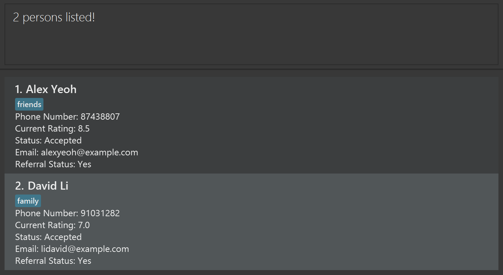

# HireShell

HireShell is a **desktop contact management application** designed for **Job Recruiters** who prefer **speed and efficiency** 
in managing (e.g. adding, deleting, editing) a large number of applicant contacts. It combines a Command Line Interface 
(CLI) with the clarity of a Graphical User Interface (GUI).

If you are a Job Recruiter and are comfortable typing commands fast, HireShell helps you to organise, categorise and 
filter applicant contacts quickly, with minimal use of a mouse.

Instead of clicking through multiple menus, you can perform all actions using simple, structured commands. 
This lets you manage and review applicants more efficiently once you are familiar with the command format.

**What you can expect**\
In this guide, you will find:
- A [Quick Start](#quick-start) section to get the app running
- An overview of the user interface
- Step-by-step instructions for using commands
- Examples to help you learn faster
- Troubleshooting tips

<!-- * Table of Contents -->
<page-nav-print />

--------------------------------------------------------------------------------------------------------------------

## Quick Start

1. Ensure you have Java `17` or above installed in your computer.<br>
   **Mac users:** Follow the setup guide [here](https://se-education.org/guides/tutorials/javaInstallationMac.html).

2. Download the latest `hireshell.jar` file from [here](https://github.com/AY2526S2-CS2103T-T10-3/tp/releases).

3. Create a folder (e.g. named **HireShell**).

4. Move the `hireshell.jar` file into this folder.

5. Open a command terminal and navigate to the **HireShell** folder.
   - **Windows:** Use Command Prompt or PowerShell
   - **Mac/Linux:** Use Terminal 

Example: 
```bash
cd path/to/HireShell
```

6. Run the application using the following command: 
```
java -jar hireshell.jar
```

7. If the setup is successful, the HireShell GUI (see below) should appear in a few seconds. \
_**Note that the app contains sample data.**_<br> \


8. Type the command in the command box and press `Enter` to execute it. e.g. typing **`help`** and pressing `Enter` will open the help window.<br> \
   Some example commands you can try:

   * `list` : Lists all contacts.

   * `add n/John Doe p/98765432 e/johnd@example.com rt/8.5 s/Fresh rs/Yes r/Software Engineer` : Adds a contact named `John Doe` to the Address Book.

   * `delete 3` : Deletes the 3rd contact shown in the current list.

   * `clear` : Deletes all contacts.

   * `exit` : Exits the app.

9. Refer to the [Features](#features) below for details of each command.

--------------------------------------------------------------------------------------------------------------------

## Features

<box type="info" seamless>

**Notes about the command format:**<br>

* Words in `UPPER_CASE` are the parameters to be supplied by the user.<br>
  e.g. in `add n/NAME`, `NAME` is a parameter which can be used as `add n/John Doe`.

* Items in square brackets are optional.<br>
  e.g `n/NAME [r/ROLE]` can be used as `n/John Doe r/Software Engineer` or as `n/John Doe`.

* Items with `…`​ after them can be used multiple times including zero times.<br>
  e.g. `[r/ROLE]…​` can be used as ` ` (i.e. 0 times), `r/Software Engineer`, `r/Software Engineer r/AI Analyst` etc.

* Parameters can be in any order.<br>
  e.g. if the command specifies `n/NAME p/PHONE_NUMBER`, `p/PHONE_NUMBER n/NAME` is also acceptable.

* Extraneous parameters for commands that do not take in parameters (such as `help`, `list`, `exit` and `clear`) will be ignored.<br>
  e.g. if the command specifies `help 123`, it will be interpreted as `help`.

* If you are using a PDF version of this document, be careful when copying and pasting commands that span multiple lines as space characters surrounding line-breaks may be omitted when copied over to the application.
</box>

### Viewing help : `help`

Shows a message explaining how to access the help page.


Format: `help`


### Adding a person: `add`

Adds a person to the address book.

Format: `add  n/NAME p/PHONE e/EMAIL rt/RATING s/STATUS rs/REFERRAL_STATUS [r/ROLE]…​`

<box type="tip" seamless>

**Tip:** A person can have any number of roles (including 0)
</box>

Examples:
* `add n/John Doe p/98765432 e/johnd@example.com rt/8.5 s/Approved rs/Yes`
* `add n/Betsy Crowe e/betsycrowe@example.com rt/9 s/Fresh rs/Yes p/91234567 r/SoftwareEngineer r/QuantitativeResearcher`

### Listing all persons : `list`

Shows a list of all persons in the address book.

Format: `list`

### Editing a person : `edit`

Edits an existing person in the address book.

Format: `edit INDEX [n/NAME] [p/PHONE] [e/EMAIL] [rt/RATING] [s/STATUS] [rs/REFERRAL_STATUS] [r/ROLE]…​`

* Edits the person at the specified `INDEX`. The index refers to the index number shown in the displayed person list. The index **must be a positive integer** 1, 2, 3, …​
* At least one of the optional fields must be provided.
* Existing values will be updated to the input values.
* When editing roles, the existing roles of the person will be removed i.e adding of roles is not cumulative.
* You can remove all the person’s roles by typing `r/` without
    specifying any roles after it.

Examples:
*  `edit 1 p/91234567 e/johndoe@example.com` Edits the phone number and email address of the 1st person to be `91234567` and `johndoe@example.com` respectively.
*  `edit 2 n/Betsy Crower r/` Edits the name of the 2nd person to be `Betsy Crower` and clears all existing roles.

### Locating persons by name: `find`

Finds persons whose names contain any of the given keywords.

Format: `find KEYWORD [MORE_KEYWORDS]`

* The search is case-insensitive. e.g `hans` will match `Hans`
* The order of the keywords does not matter. e.g. `Hans Bo` will match `Bo Hans`
* Only the name is searched.
* Only full words will be matched e.g. `Han` will not match `Hans`
* Persons matching at least one keyword will be returned (i.e. `OR` search).
  e.g. `Hans Bo` will return `Hans Gruber`, `Bo Yang`

Examples:
* `find John` returns `john` and `John Doe`
* `find alex david` returns `Alex Yeoh`, `David Li`<br>
  

### Deleting a person : `delete`

Deletes the specified person from the address book.

Format: `delete INDEX`

* Deletes the person at the specified `INDEX`.
* The index refers to the index number shown in the displayed person list.
* The index **must be a positive integer** 1, 2, 3, …​

Examples:
* `list` followed by `delete 2` deletes the 2nd person in the address book.
* `find Betsy` followed by `delete 1` deletes the 1st person in the results of the `find` command.

### Clearing all entries : `clear`

Clears all entries from the address book.

Format: `clear`

### Exiting the program : `exit`

Exits the program.

Format: `exit`

### Saving the data

HireShell data are saved in the hard disk automatically after any command that changes the data. There is no need to save manually.

### Editing the data file

HireShell data are saved automatically as a JSON file `[JAR file location]/data/hireshell.json`. Advanced users are welcome to update data directly by editing that data file.

<box type="warning" seamless>

**Caution:**
If your changes to the data file makes its format invalid, HireShell will discard all data and start with an empty data file at the next run.  Hence, it is recommended to take a backup of the file before editing it.<br>
Furthermore, certain edits can cause the HireShell to behave in unexpected ways (e.g., if a value entered is outside the acceptable range). Therefore, edit the data file only if you are confident that you can update it correctly.
</box>

### Archiving data files `[coming in v2.0]`

_Details coming soon ..._

--------------------------------------------------------------------------------------------------------------------

## FAQ

**Q**: How do I transfer my data to another Computer?<br>
**A**: Install the app in the other computer and overwrite the empty data file it creates with the file that contains the data of your previous HireShell home folder.

--------------------------------------------------------------------------------------------------------------------

## Known issues

1. **When using multiple screens**, if you move the application to a secondary screen, and later switch to using only the primary screen, the GUI will open off-screen. The remedy is to delete the `preferences.json` file created by the application before running the application again.
2. **If you minimize the Help Window** and then run the `help` command (or use the `Help` menu, or the keyboard shortcut `F1`) again, the original Help Window will remain minimized, and no new Help Window will appear. The remedy is to manually restore the minimized Help Window.

--------------------------------------------------------------------------------------------------------------------

## Command summary

Action     | Format, Examples
-----------|----------------------------------------------------------------------------------------------------------------------------------------------------------------------
**Add**    | `add n/NAME p/PHONE_NUMBER e/EMAIL rt/RATING s/STATUS rs/REFERRAL_STATUS r/ROLE…​` <br> e.g., `add n/James Ho p/22224444 e/jamesho@example.com rt/8.5 s/Approved rs/Yes r/SoftwareEngineer`
**Clear**  | `clear`
**Delete** | `delete INDEX`<br> e.g., `delete 3`
**Edit**   | `edit INDEX [n/NAME] [p/PHONE_NUMBER] [e/EMAIL] [rt/RATING] [s/STATUS] [rs/REFERRAL_STATUS] [r/ROLE]…​`<br> e.g.,`edit 2 n/James Lee e/jameslee@example.com rt/9.0`
**Find**   | `find KEYWORD [MORE_KEYWORDS]`<br> e.g., `find James Jake`
**List**   | `list`
**Help**   | `help`
